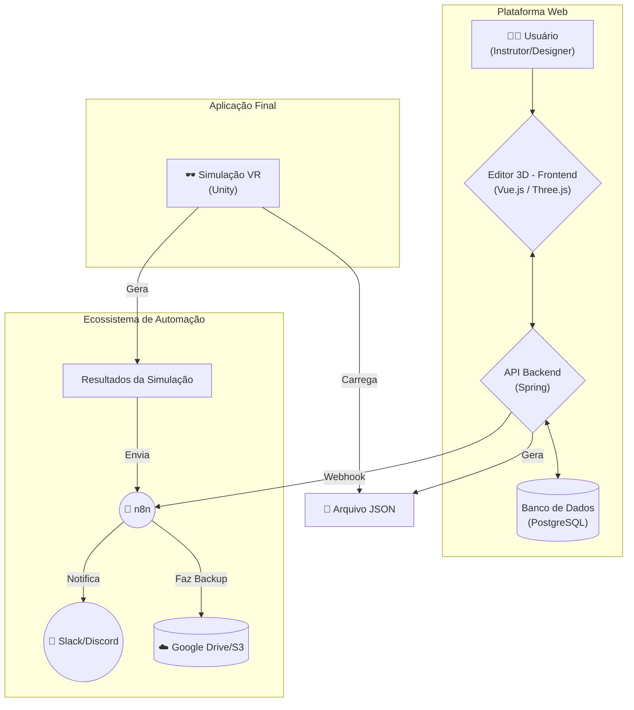

# スキル-E (Skill-E)

    

Uma plataforma inovadora para a criação visual e dinâmica de cenários de simulação para Realidade Virtual (VR).

## 📜 Índice

1.  [✨ Visão Geral](#-visão-geral)
2.  [🏛️ Arquitetura do Sistema](#️-arquitetura-do-sistema)
3.  [💻 Tecnologias Utilizadas](#-tecnologias-utilizadas)
4.  [🚀 Como Começar](#-como-começar)
5.  [🤖 Automação com n8n](#-automação-com-n8n)
6.  [🤝 Como Contribuir](#-como-contribuir)
7.  [📜 Licença](#-licença)

## ✨ Visão Geral

O **Skill-E** nasceu para resolver um grande desafio no desenvolvimento de treinamentos em VR: a complexidade e a lentidão para criar e modificar cenários de simulação. A dependência de desenvolvedores e da interface técnica da Unity cria um gargalo que impede a agilidade e a colaboração de especialistas de outras áreas, como instrutores e designers.

Nossa solução é uma **plataforma web com um editor 3D intuitivo**, que abstrai a complexidade da engine. Com o Skill-E, usuários autorizados podem montar cenários complexos de forma visual, com um sistema de "arrastar e soltar", diretamente do navegador.

### Funcionalidades Principais

* **🎨 Editor Visual 3D:** Crie e posicione objetos em um ambiente 3D interativo.
* **🧩 Gerenciamento de Assets:** Utilize uma biblioteca de objetos 3D pré-aprovados e otimizados.
* **🚀 Implantação Dinâmica:** Os cenários são exportados como um arquivo JSON e carregados dinamicamente pela aplicação Unity/VR, sem a necessidade de uma nova compilação.
* **🤖 Workflows Automatizados:** Integração com n8n para notificações, backups e processamento de resultados, otimizando todo o ciclo de vida da simulação.

## 🏛️ Arquitetura do Sistema

O Skill-E utiliza uma arquitetura de microsserviços desacoplada, garantindo escalabilidade e manutenibilidade.


1.  **Plataforma Web:** O usuário interage com o editor visual (Frontend), que se comunica com a API (Backend) para persistir os dados no Banco de Dados.
2.  **Geração de Dados:** A API gera um arquivo JSON que descreve o cenário completo.
3.  **Simulação VR:** A aplicação em Unity baixa e lê o arquivo JSON para construir a cena dinamicamente em tempo de execução.
4.  **Automação:** Eventos na plataforma (como salvar um cenário) ou na simulação (fim de um treinamento) disparam workflows no n8n para tarefas secundárias.

## 💻 Tecnologias Utilizadas

| Componente | Tecnologias Chave |
| :--- | :--- |
| **Frontend** | Vuejs, Vite, Three.js |
| **Backend** | Spring Boot, PostgreSQL, JWT |
| **Simulação** | Unity 2022.3+, C#, OpenXR, URP, Newtonsoft.Json |
| **Automação** | n8n (self-hosted via Docker) |
| **DevOps** | Docker, Git |

## 🚀 Como Começar

Siga os passos para configurar o ambiente de desenvolvimento local.

### Pré-requisitos

* Spring Boot
* Vuejs
* Docker e Docker Compose
* Unity Hub e Unity Editor (2022.3.x LTS)

### Instalação

1.  **Clone o repositório:**
    ```sh
    git clone [https://github.com/SEU_USUARIO/skill-e.git](https://github.com/SEU_USUARIO/skill-e.git)
    cd skill-e
    ```

2.  **Suba os serviços de backend:**
    ```sh
    cd backend
    cp .env.example .env 
    # Preencha as variáveis no arquivo .env
    docker-compose up -d # Sobe o banco de dados
    npm install
    npm run dev
    ```

3.  **Inicie o frontend:**
    ```sh
    cd ../frontend
    npm install
    npm run dev
    ```
    Acesse o editor em `http://localhost:5173`.

4.  **Abra o projeto Unity:**
    * Use o Unity Hub para abrir a pasta `unity-project`.
    * Ajuste o endpoint da API no script de configuração para `http://localhost:3000/api`.

## 🤖 Automação com n8n

O n8n é usado para automatizar processos e conectar o Skill-E a outras ferramentas. Os workflows estão na pasta `/n8n` e podem ser importados.
* **Notificações:** Avisa a equipe sobre novos cenários e resultados de simulações.
* **Backups:** Gera cópias de segurança dos arquivos JSON em um storage na nuvem.
* **Relatórios:** Coleta dados das simulações e os consolida em planilhas.

## 🤝 Como Contribuir

Sua contribuição é muito bem-vinda!

1.  Faça um **Fork** do projeto.
2.  Crie sua **Branch** (`git checkout -b feature/MinhaFeature`).
3.  Faça o **Commit** (`git commit -m 'Adiciona MinhaFeature'`).
4.  Faça o **Push** (`git push origin feature/MinhaFeature`).
5.  Abra um **Pull Request**.

## 📜 Licença

Distribuído sob a licença MIT. Veja o arquivo `LICENSE` para mais detalhes.
